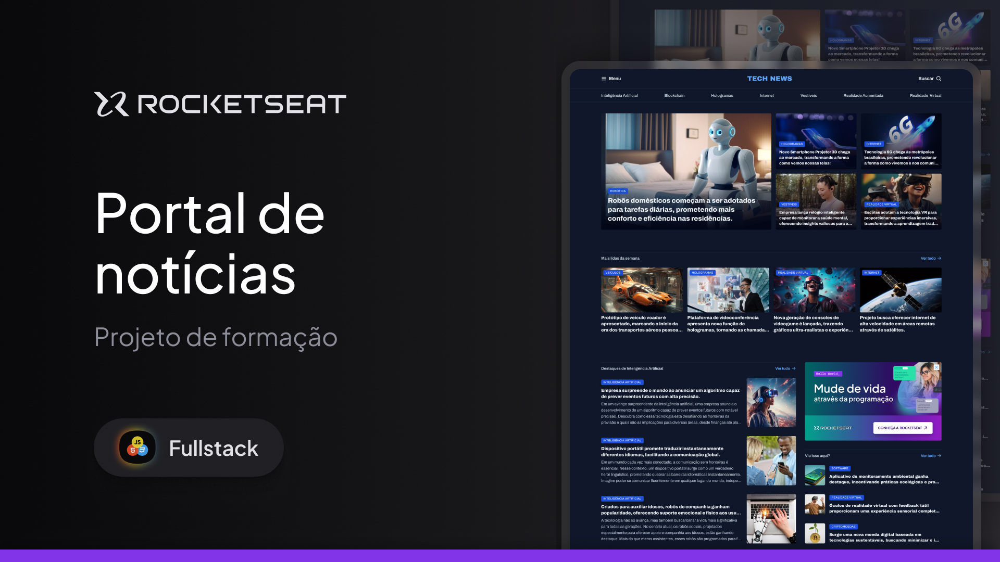

<h1 align="center">Portal de Notícias </h1>

Programa feito no quadro do curso Full-Stack da Rocketseat.  

 

  
  Imagem feita por <a href="https://www.linkedin.com/in/ilanamallak/">Ilana Mallak</a>

## 🚀 Tecnologias

Esse projeto foi desenvolvido com as seguintes tecnologias:

- HTML e CSS
- Git e Github
- Figma

## 🖥️ Projeto

O projeto é uma homepage de um portal de notícias sobre tecnologia para ser visualizado em um desktop.
Esse é um dos projetos desenvolvidos em aula na formação Full-Stack, um de nossos conteúdos de especialização.
